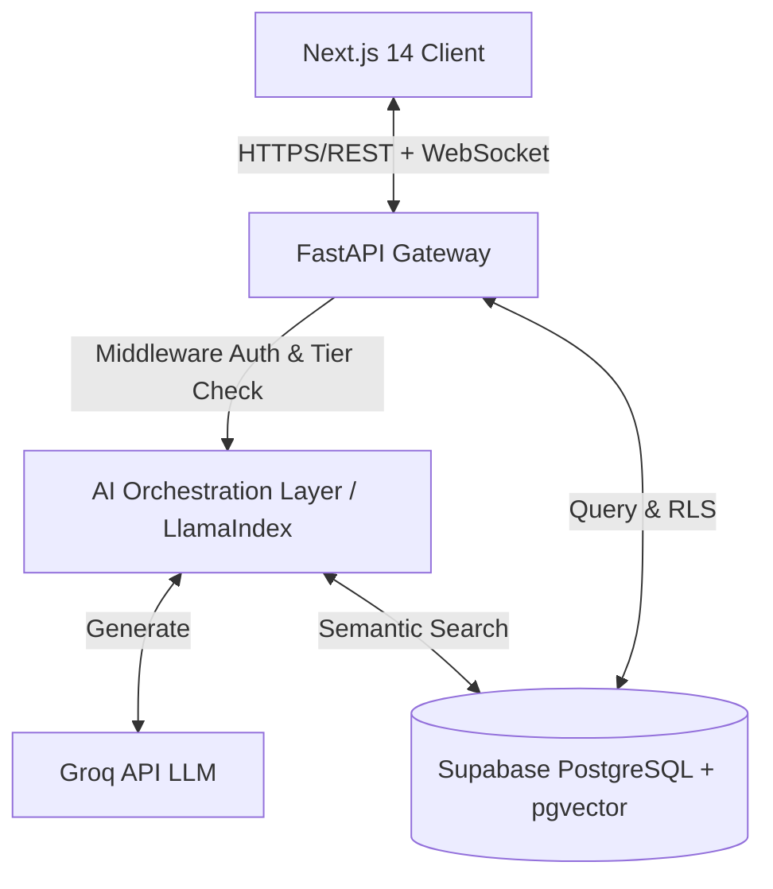

<div align="center">
  <h1>🚀 NobleSoft</h1>
  <p><b>The Enterprise AI Operating System for Indonesian MSMEs</b></p>
  
  [](https://fastapi.tiangolo.com/)
  [](https://nextjs.org/)
  [](https://supabase.com/)
  [](https://www.python.org/)
  [](https://www.typescriptlang.org/)
  [](https://tailwindcss.com/)
</div>

<br />

## 📖 About NobleSoft

NobleSoft is a localized B2B SaaS (Software as a Service) platform designed to serve mid-market enterprises, modern retail, and multi-branch businesses in Indonesia (starting from the Solo Raya region). 

By acting as a comprehensive **AI Operating System**, NobleSoft solves the problem of "app fatigue" and data silos. It unifies operations—like inventory, invoicing, onboarding, customer support, and quarterly business reviews (QBR)—into one cohesive platform. The built-in AI brain understands the historical context of the business, delivering fast insights and operational automations.

## ✨ Key Features

- 🏢 **True Multi-Tenancy**: Built-in data isolation using Supabase Row Level Security (RLS) guaranteeing complete data privacy between tenants.
- 💳 **Tiered Subscriptions**: Features are intelligently unlocked based on the active plan:
  - **Basic**: Core invoicing, payment tracking, basic inventory, and main dashboard.
  - **Pro**: Unlocks conversational AI, intelligent product recommendations, and analytics.
  - **Enterprise**: Unlocks multi-branch support, priority SLAs, advanced compliance, and deep QBR/onboarding features.
- 🤖 **Context-Aware AI Assistant**: Integrated RAG (Retrieval-Augmented Generation) pipeline using LlamaIndex, `pgvector`, and the blazing-fast Groq API for near-instant generative insights.
- 💼 **Enterprise Operations Suite**: Fully-fledged service layer handling custom customer onboarding, continuous support ticketing, and automated Quarterly Business Reviews (QBR).
- 🔒 **Enterprise-Grade Security**: JWT-based stateless authentication, strict rate limiting, and robust middleware pipelines.

## 🛠 Tech Stack

### Frontend
- **Framework:** Next.js 14 (App Router)
- **Language:** TypeScript
- **Styling:** Tailwind CSS + PostCSS
- **UI Components:** shadcn/ui

### Backend
- **Framework:** FastAPI (Python 3.10+)
- **AI/ML Engine:** LlamaIndex + Groq API
- **Testing:** Pytest with extensive coverage

### Database & Infrastructure
- **Database:** Supabase (PostgreSQL)
- **Vector DB:** `pgvector` for AI embeddings
- **Auth:** Supabase Auth (JWT)

## 📐 System Architecture

At its core, NobleSoft handles complex asynchronous operations between an interactive Next.js dashboard, a FastAPI gateway, and a highly restrictive PostgreSQL database.



## 📂 Repository Structure

```text
noblesoft/
├── backend/                 # Python FastAPI Backend
│   ├── app/                 # Application code (API, Core, Models, Services, AI)
│   ├── tests/               # Pytest suite
│   ├── scripts/             # Utility and migration scripts
│   └── requirements.txt     # Python dependencies
├── frontend/                # Next.js Frontend
│   ├── src/                 # Application code (Components, Hooks, Lib, Pages)
│   ├── tailwind.config.ts   # UI styling configuration
│   └── package.json         # Node.js dependencies
└── *.sql                    # Supabase schema definitions and seed data
```

## 🚀 Getting Started

### Prerequisites
- Node.js 18+
- Python 3.10+
- Supabase Account / Local CLI

### 1. Database Setup
Create a new Supabase project and execute the schema files located at the root of the repository in the following order via the SQL Editor:
1. `supabase_setup.sql` 
2. `supabase_phase4_governance.sql`
3. `supabase_phase5_enterprise_engagement.sql`

### 2. General Automated Run (Windows)
If you are on a Windows environment, you can use the included PowerShell scripts to instantly preflight checks and spin up both servers.

```powershell
# Run system checks
.\preflight.ps1

# Start both Backend and Frontend environments
.\run-dev.ps1

# To safely tear down the environment
.\stop-dev.ps1
```

### 3. Manual Setup

**Backend:**
For detailed manual setup, environment variables configurations, and testing guides, please refer to the [Backend README](./backend/README.md).

**Frontend:**
For frontend layout, components structure, and styling architecture, please refer to the [Frontend README](./frontend/README.md).

## 🧪 Testing and Quality Assurance

The platform relies on rigorous test-driven principles:
- Run `pytest` within the `backend/` directory to validate endpoint health, RLS capabilities, rate-limiting, and tier-enforcement.
- End-to-end integration tests are documented in the [API Testing Guide](./backend/API_TESTING_GUIDE.md).

## 📄 License & Proprietary Rights

This repository and its codebase are strictly **Proprietary**.

All rights reserved © 2026 NobleSoft. 
Unauthorized copying, modification, or distribution of this software, via any medium, is strictly prohibited.
